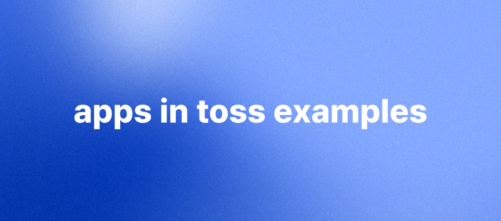

# Apps in Toss Examples

**Apps in Toss**는 토스 앱 안에 입점사의 서비스를 담을 수 있는 새로운 미니앱 생태계예요.  
이 레포지토리에는 **Apps in Toss** 개발에 참고할 수 있는 다양한 예시들이 담겨 있고, 예시 파일을 다운로드하면 바로 테스트해볼 수 있어요.  
더 자세한 내용은 각 예시 디렉토리에 있는 `README.md` 파일을 참고해 주세요.

 

## 예제 목록

- [공통 API 예제](./common-apis): 파일 저장소와 네트워크, 실행 환경 API를 확인할 수 있어요.
- [유입 & 성장 기능 예제](./growth): 프로모션, 리뷰 요청, 스마트 발송, 공유 리워드, 공유, 분석 기능을 확인할 수 있어요.
- [인앱 결제 예제](./in-app-payments): 콘솔에 등록한 인앱 상품 목록을 조회하고 구매, 미결 주문 복원 흐름을 확인할 수 있어요.
- [인앱 광고 예제](./in-app-ads): 전면형, 보상형, WebView 배너 광고와 광고 정책 검증 패턴을 확인할 수 있어요.

## 📌 참고사항

- [앱인토스 개발자센터](https://developers-apps-in-toss.toss.im/)
- [앱인토스 콘솔](https://apps-in-toss.toss.im/)

## 라이선스

이 프로젝트는 Apache License 2.0에 따라 라이선스가 부여되어 있어요. 자세한 내용은 [LICENSE](./LICENSE)를 참고해 주세요.
