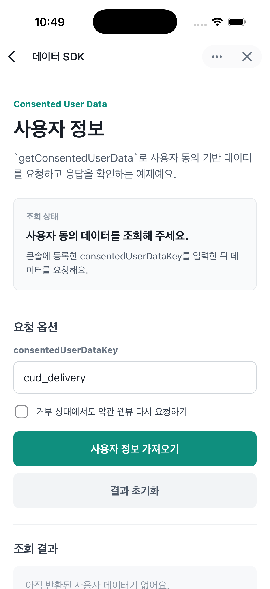

# Data SDK

Apps in Toss WebView 환경에서 사용자 동의 기반 데이터를 가져오는 예제예요.

`getConsentedUserData`는 앱인토스 콘솔에 등록한 사용자 데이터 제공 동의문과 데이터 묶음을 기준으로 사용자 데이터를 요청해요. 동의가 필요한 경우 약관 웹뷰를 띄우고, 동의가 완료되면 서버에서 조회한 사용자 데이터를 반환해요.

이 예제는 앱인토스 개발자센터의 [사용자 정보 - getConsentedUserData](https://developers-apps-in-toss.toss.im/bedrock/reference/framework/%EC%9C%A0%EC%A0%80%20%EC%A0%95%EB%B3%B4/getConsentedUserData.html) 문서를 참고해 만들었어요.

## 실행 화면



## 꼭 확인하세요

- `getConsentedUserData`를 사용하려면 먼저 앱인토스 콘솔에서 사용자 정보 불러오기를 등록해야 해요.
- 콘솔에서 등록한 `consentedUserDataKey`를 예제 화면에 입력해야 해요.
- 토스앱 5.264.0 이상에서 지원돼요. 그보다 낮은 버전에서는 `undefined`가 반환돼요.
- `USER_ADDRESS`, `USER_EMAIL`은 사용자가 토스에 등록하지 않은 경우 `null`로 전달될 수 있어요.
- 사용자는 토스앱 설정에서 미니앱별 동의를 철회할 수 있어요.

## 요청 옵션

| 옵션 | 설명 |
| --- | --- |
| `consentedUserDataKey` | 서버가 사용자 데이터 제공 동의문과 데이터 묶음을 찾을 때 쓰는 key예요. 예: `cud_delivery` |
| `shouldRequestAgreementWhenUserDeclined` | `USER_DECLINED` 상태에서도 약관 웹뷰를 다시 띄울지 정해요. 기본값은 `false`예요. |

## 반환 데이터

`ConsentedUserData`에는 콘솔에서 설정하고 사용자가 동의한 데이터 항목만 포함될 수 있어요.

| 키 | 설명 |
| --- | --- |
| `USER_NAME` | 사용자 이름 |
| `USER_GENDER` | 사용자 성별 |
| `USER_NATIONALITY` | 내국인/외국인 여부 |
| `USER_BIRTHDAY` | 사용자 생년월일 |
| `USER_PHONE` | 사용자 휴대전화번호 |
| `USER_ADDRESS` | 사용자 집 주소 |
| `USER_EMAIL` | 사용자 이메일 주소 |
| `USER_CONSUMPTION_HISTORY` | 콘솔에서 설정한 사용자 소비 이력 데이터 |

## 에러 코드

| 에러 코드 | 설명 |
| --- | --- |
| `USER_DECLINED` | 사용자가 명시적으로 동의를 거부했어요. |
| `UNAVAILABLE` | 서버가 사용자 동의 여부를 판단할 수 없어요. |
| `TERMS_NOT_SET` | 미니앱에 사용자 데이터 제공 동의문이 설정되지 않았어요. |
| `INVALID_REQUEST` | `consentedUserDataKey`가 비어 있거나 약관 URL 설정이 올바르지 않아요. |
| `CANCELED` | 약관 웹뷰가 결과를 보내기 전에 닫혔어요. |
| `CONSENTED_USER_DATA_AGREEMENT_FAILED` | 약관 웹뷰 처리 중 오류가 발생했어요. |
| `CONSENTED_USER_DATA_INVALID_DATA` | 동의 데이터 응답이 올바르지 않아요. |

## 설치

### npm

```bash
npm install
```

### yarn

```bash
yarn install
```

### pnpm

```bash
pnpm install
```

## 실행

```bash
npm run dev
```

기본 개발 서버는 `apps-in-toss.config.ts`의 설정에 따라 `http://localhost:5173`에서 실행돼요.

## 빌드와 배포

### npm

```bash
npm run build
npm run deploy
```

### yarn

```bash
yarn build
yarn deploy
```

### pnpm

```bash
pnpm build
pnpm deploy
```

## 구현 흐름

1. 콘솔에 등록한 `consentedUserDataKey`를 입력해요.
2. `getConsentedUserData`를 호출해 사용자 동의 기반 데이터를 요청해요.
3. 동의가 필요한 경우 토스앱에서 약관 웹뷰가 열려요.
4. 사용자가 동의하면 응답에 포함된 사용자 데이터를 화면에 표시해요.
5. 에러가 발생하면 에러 코드별로 원인과 확인할 설정을 안내해요.
