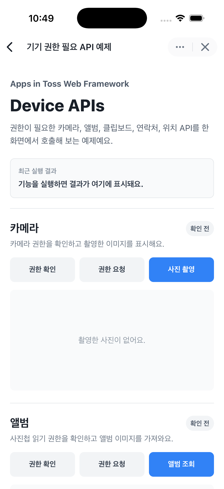

# 기기 권한 필요 API 예제

카메라, 앨범, 클립보드, 연락처, 위치처럼 사용자 권한이 필요한 디바이스 API를 한 화면에서 호출해 보는 예제예요.

이 예제는 앱인토스 개발자센터의 [권한 문서](https://developers-apps-in-toss.toss.im/bedrock/reference/framework/%EA%B6%8C%ED%95%9C/permission.html)를 참고해 만들었어요.

## 실행 화면



## 포함된 기능

- `openCamera`: 카메라를 열고 촬영한 이미지를 가져와요.
- `fetchAlbumPhotos`: 앨범에서 이미지를 가져와요.
- `getClipboardText`: 클립보드의 텍스트를 읽어요.
- `setClipboardText`: 텍스트를 클립보드에 복사해요.
- `fetchContacts`: 연락처를 페이지 단위로 가져와요.
- `getCurrentLocation`: 현재 위치 정보를 가져와요.
- `startUpdateLocation`: 위치 변경을 실시간으로 감지해요.

각 기능은 아래 흐름을 같은 패턴으로 보여줘요.

1. 현재 권한 상태 확인
2. 권한 요청 다이얼로그 열기
3. 실제 API 호출
4. 호출 결과 또는 오류 메시지 표시

## 권한 설정

권한이 필요한 API는 `apps-in-toss.config.ts`의 `permissions`에 미리 선언해야 해요.

```ts
import { defineConfig } from "@apps-in-toss/web-framework/config";

export default defineConfig({
  ...
  permissions: [
    {
      name: "camera",
      access: "access",
    },
    {
      name: "photos",
      access: "read",
    },
    {
      name: "clipboard",
      access: "read",
    },
    {
      name: "clipboard",
      access: "write",
    },
    {
      name: "contacts",
      access: "read",
    },
    {
      name: "geolocation",
      access: "access",
    },
  ],
  ...
});
```

## 설치 및 실행 방법

1. **ZIP 파일**을 다운로드하고 압축을 풀어주세요.

2. 예제 폴더로 이동해요.

   ```bash
   cd device-apis
   ```

3. 필요한 패키지를 설치해요.

   | 패키지 매니저 | 명령어 |
   | --- | --- |
   | npm | `npm install` |
   | yarn | `yarn install` |
   | pnpm | `pnpm install` |

4. 개발 서버를 실행해요.

   | 패키지 매니저 | 명령어 |
   | --- | --- |
   | npm | `npm run dev` |
   | yarn | `yarn dev` |
   | pnpm | `pnpm dev` |

5. 개발 서버가 실행되면 샌드박스 앱으로 예제를 확인해요. 일반 브라우저에서는 권한 API 호출이 실패할 수 있어요.


## 구현 참고

- 카메라와 앨범 이미지는 `base64: true` 옵션으로 가져와요.
- Base64 이미지를 ``에 표시할 때는 `data:image/jpeg;base64,` prefix를 붙여요.
- 연락처는 `offset`과 `nextOffset`을 사용해 다음 페이지를 가져와요.
- 현재 위치 조회와 실시간 위치 감지는 정확도와 배터리 사용량의 균형을 위해 `Accuracy.Balanced`에 해당하는 값을 사용해요.
- `startUpdateLocation`은 위치 감지를 중지할 수 있는 정리 함수를 반환해요. 예제에서는 중지 버튼과 컴포넌트 정리 시점에 이 함수를 호출해요.

## 유용한 링크

- [앱인토스 권한 문서](https://developers-apps-in-toss.toss.im/bedrock/reference/framework/%EA%B6%8C%ED%95%9C/permission.html)
- [앱인토스 콘솔](https://apps-in-toss.toss.im/)
- [앱인토스 개발자센터](https://developers-apps-in-toss.toss.im/)
- [앱인토스 개발자 커뮤니티](https://techchat-apps-in-toss.toss.im/)
