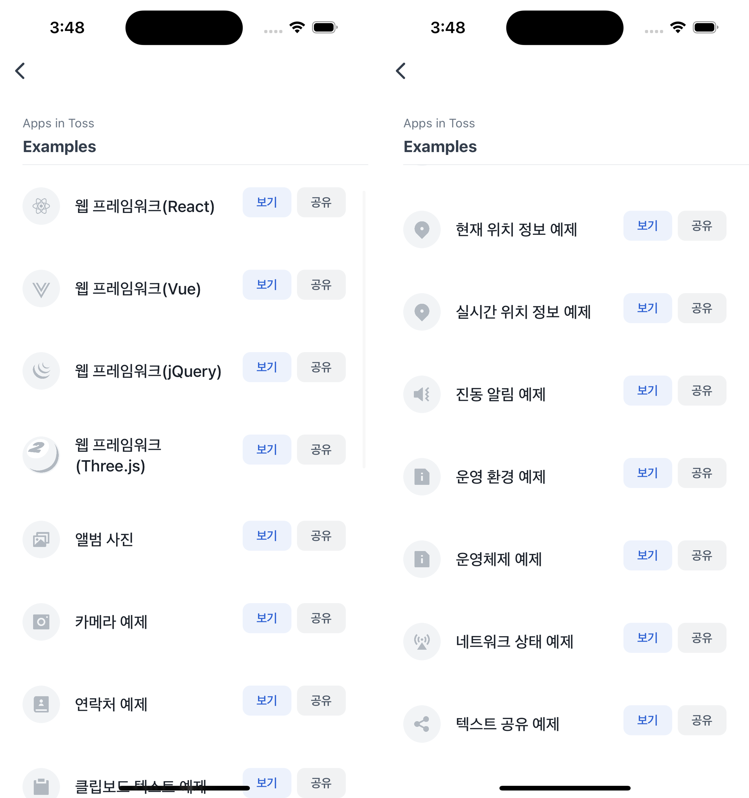

# Apps in Toss Examples


`apps-in-toss-examples`를 모아 볼 수 있는 예제에요.  
리스트를 통해 예제를 확인하거나, 공유할 수 있어요. ⚠️ 예제를 실행하려면 토스 앱이 설치되어 있어야 해요.



<br />

## 📲 체험하기

&nbsp;

<br />

## 🚀 설치 및 실행 방법

1. **ZIP 파일**을 다운로드하고 압축을 풀어주세요.

2. 필요한 패키지를 설치해요.

   ```
   yarn install
   ```

3. 개발 서버를 실행해요.

   ```
   yarn dev
   ```

<br />

## 📌 참고사항

- [앱인토스란](https://developers-apps-in-toss.toss.im/intro/overview.html)
