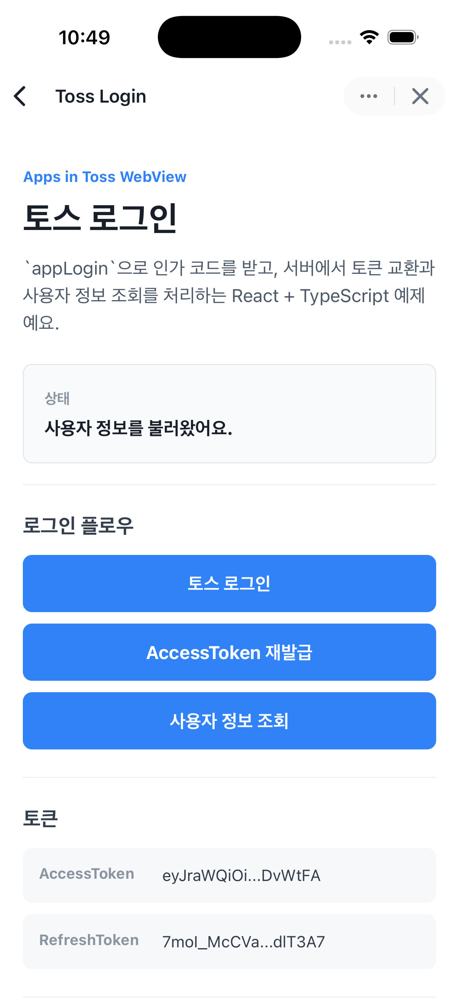

# Toss Login

Apps in Toss WebView 환경에서 토스 로그인을 연동하는 React + TypeScript 예제예요.

클라이언트는 `@apps-in-toss/web-framework`의 `appLogin`으로 인가 코드(`authorizationCode`)와 `referrer`를 받고, 서버는 받은 인가 코드를 토스 로그인 API로 전달해 AccessToken과 RefreshToken을 발급받아요. 사용자 정보 조회와 로그아웃도 서버를 통해 처리해요.

이 예제는 앱인토스 개발자센터의 [토스 로그인 - 인가 코드 받기](https://developers-apps-in-toss.toss.im/bedrock/reference/framework/%EB%A1%9C%EA%B7%B8%EC%9D%B8/appLogin.html)와 [토스 로그인 개발하기](https://developers-apps-in-toss.toss.im/login/develop.html)를 참고해 만들었어요.

## 실행 화면



## 꼭 확인하세요

토스 로그인은 클라이언트 코드만으로 동작하지 않아요. 실제 서비스에서는 반드시 파트너사 서버가 필요해요.

이 예제의 `server/` 폴더는 토스 로그인 연동 흐름을 이해하기 위한 샘플 서버예요. 실제 서비스에 적용할 때는 이 서버 코드를 참고해서 자체 서버에 필요한 라우트와 로직을 구현하고, 인증서와 복호화 키 같은 민감한 값은 자체 서버 환경 변수나 비밀 관리 시스템에 안전하게 저장해 주세요.

클라이언트는 `appLogin()`으로 인가 코드만 받아요. 인가 코드를 AccessToken으로 교환하거나, RefreshToken을 사용하거나, 사용자 정보를 조회하는 작업은 모두 서버에서 처리해야 해요.

## 프로젝트 구조

```text
toss-login
├── src/                 # WebView 클라이언트
├── server/              # 토스 로그인 API를 호출하는 Express 서버
├── apps-in-toss.config.ts # 앱인토스 WebView 설정
└── package.json
```

## 실행 전 준비

토큰 교환과 사용자 정보 조회는 서버에서 처리해야 해요. 실행 전에 `server/.env.server` 값을 실제 개발 환경에 맞게 채워주세요.

```dotenv
CLIENT_CERT_PATH=cert/mock_public.crt
CLIENT_KEY_PATH=cert/mock_private.key
AAD_STRING={AAD}
DECRYPTION_KEY_BASE64={복호화_키_값}
AUTH_API_BASE=https://apps-in-toss-api.toss.im/api-partner/v1/apps-in-toss/user/oauth2
PORT=4000
```

- `CLIENT_CERT_PATH`, `CLIENT_KEY_PATH`: 앱인토스 API 호출에 사용하는 mTLS 인증서 경로예요.
- `AAD_STRING`, `DECRYPTION_KEY_BASE64`: 사용자 정보 응답을 복호화할 때 사용해요.
- `AUTH_API_BASE`: 토스 로그인 API Gateway 주소예요.
- `PORT`: 예제 서버가 실행될 포트예요.

클라이언트는 기본으로 `http://localhost:4000` 서버를 호출해요. 다른 주소를 사용하려면 `toss-login/.env.local`에 아래 값을 추가하세요.

```dotenv
VITE_SERVER_BASE_URL=http://localhost:4000
```

## 설치

```bash
npm install
cd server
npm install
```

## 실행

서버와 클라이언트를 각각 다른 터미널에서 실행해요.

### 1. 서버 실행

```bash
cd server
npm run dev
```

서버는 기본으로 `http://localhost:4000`에서 실행돼요.

### 2. 클라이언트 실행

```bash
npm run dev
```

클라이언트는 `apps-in-toss.config.ts`의 `http://localhost:5173`에서 실행돼요.

## 빌드와 배포

```bash
npm run build
npm run deploy
```

## 예제에서 확인하는 흐름

1. `토스 로그인` 버튼을 눌러 `appLogin()`을 실행해요.
2. 클라이언트가 인가 코드와 `referrer`를 서버의 `/get-access-token`으로 전달해요.
3. 서버가 토스 로그인 API의 `/generate-token`을 호출해 AccessToken과 RefreshToken을 발급받아요.
4. `AccessToken 재발급` 버튼으로 `/refresh-token`을 호출해 AccessToken을 갱신해요.
5. `사용자 정보 조회` 버튼으로 `/get-user-info`를 호출해 사용자 정보를 조회하고 복호화해요.
6. `AccessToken 로그아웃` 또는 `userKey 로그아웃` 버튼으로 로그인 상태를 해제해요.

## 서버 API

| Method | Path | 설명 |
| --- | --- | --- |
| `POST` | `/get-access-token` | 인가 코드를 AccessToken과 RefreshToken으로 교환해요. |
| `POST` | `/refresh-token` | RefreshToken으로 AccessToken을 재발급해요. |
| `GET` | `/get-user-info` | AccessToken으로 사용자 정보를 조회하고 복호화해요. |
| `POST` | `/logout-by-access-token` | AccessToken 기준으로 로그아웃해요. |
| `POST` | `/logout-by-user-key` | userKey 기준으로 로그아웃해요. |

## 구현 참고

- `appLogin()`은 클라이언트에서 인가 코드를 받는 역할만 해요.
- 인가 코드, AccessToken, RefreshToken을 장기간 클라이언트에 저장하지 마세요.
- 토큰 교환, 토큰 갱신, 사용자 정보 조회, 로그아웃은 서버에서 처리해야 해요.
- 예제 서버는 로컬 개발 편의를 위해 CORS를 열어두었어요. 운영 서버에서는 허용할 Origin을 제한하세요.
- 실제 토스 로그인은 앱인토스 샌드박스 앱 또는 토스 앱 WebView 환경에서 테스트해야 해요.
