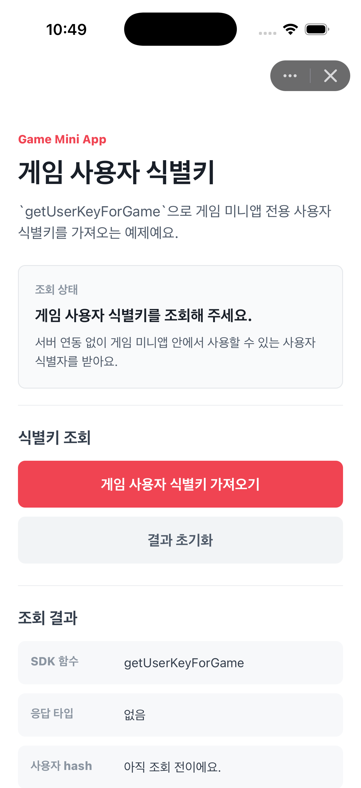
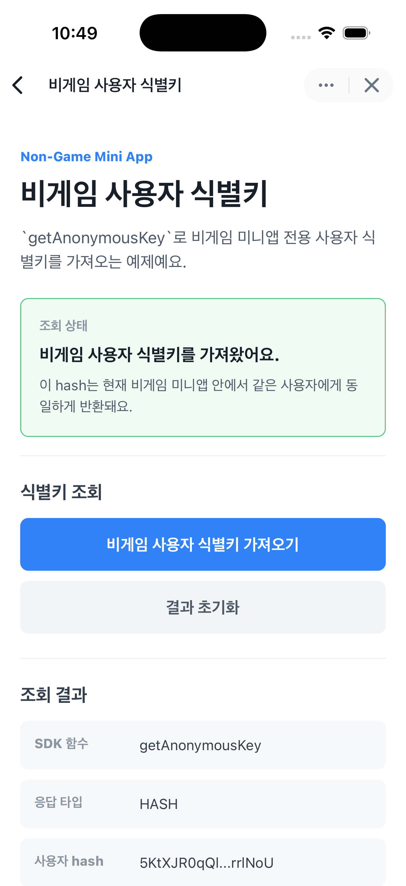

# User Identification

Apps in Toss WebView 환경에서 사용자 식별키를 발급받는 예제 모음이에요.

사용자 식별키 발급은 토스 로그인처럼 별도의 인증 화면이나 서버 연동 없이, 미니앱 안에서 같은 사용자를 안정적으로 식별할 수 있게 해요. 반환되는 `hash`는 미니앱별로 고유하며 내부 사용자 식별용 키로 사용할 수 있어요.

이 예제는 앱인토스 개발자센터의 [사용자 식별키 발급](https://developers-apps-in-toss.toss.im/user-hash-key/develop.html) 문서를 참고해 만들었어요.

## 실행 화면

| 게임 | 비게임 |
| --- | --- |
|  |  |

## 예제 구성

| 폴더 | 미니앱 유형 | SDK 함수 | 설명 |
| --- | --- | --- | --- |
| `game` | 게임 | `getUserKeyForGame` | 게임 미니앱 전용 사용자 식별키를 가져와요. |
| `non-game` | 비게임 | `getAnonymousKey` | 비게임 미니앱 전용 사용자 식별키를 가져와요. |

## 꼭 확인하세요

- `getUserKeyForGame`은 게임 카테고리 미니앱에서만 사용할 수 있어요.
- `getAnonymousKey`는 비게임 카테고리 미니앱에서만 사용할 수 있어요.
- 잘못된 카테고리에서 호출하면 `'INVALID_CATEGORY'`가 반환돼요.
- 반환되는 `hash`는 토스 서버 API 호출용 토큰이 아니에요.
- 샌드박스에서는 mock 데이터가 반환될 수 있어요. 실제 동작은 QR 코드로 토스앱에서 테스트해 주세요.

## 설치

각 예제는 독립적인 Apps in Toss WebView 앱이에요. 테스트하려는 폴더로 이동한 뒤 설치해 주세요.

### npm

```bash
cd user-identification/game
npm install
```

### yarn

```bash
cd user-identification/game
yarn install
```

### pnpm

```bash
cd user-identification/game
pnpm install
```

비게임 예제를 실행하려면 `user-identification/non-game` 폴더에서 같은 명령을 실행하면 돼요.

## 실행

### 게임 예제

```bash
cd user-identification/game
npm run dev
```

### 비게임 예제

```bash
cd user-identification/non-game
npm run dev
```

기본 개발 서버는 `apps-in-toss.config.ts`의 설정에 따라 `http://localhost:5173`에서 실행돼요.

## 빌드와 배포

### npm

```bash
npm run build
npm run deploy
```

### yarn

```bash
yarn build
yarn deploy
```

### pnpm

```bash
pnpm build
pnpm deploy
```

## 구현 흐름

1. 버튼을 눌러 카테고리에 맞는 SDK 함수를 호출해요.
2. 응답이 `undefined`이면 지원하지 않는 앱 또는 SDK 버전으로 안내해요.
3. 응답이 `'INVALID_CATEGORY'`이면 현재 미니앱 카테고리가 함수와 맞지 않는다고 안내해요.
4. 응답이 `'ERROR'`이면 알 수 없는 오류 상태로 안내해요.
5. 응답의 `type`이 `'HASH'`이면 `hash` 값을 내부 사용자 식별키로 사용해요.

## 사용 예시

게임 미니앱에서는 사용자별 랭킹, 세이브 데이터, 게임 재화, 진행 상태를 저장할 때 `hash`를 내부 키로 사용할 수 있어요.

비게임 미니앱에서는 회원가입 없이 사용자별 설정값, 진행 데이터, 익명 사용자 레코드를 관리할 때 `hash`를 내부 키로 사용할 수 있어요.
