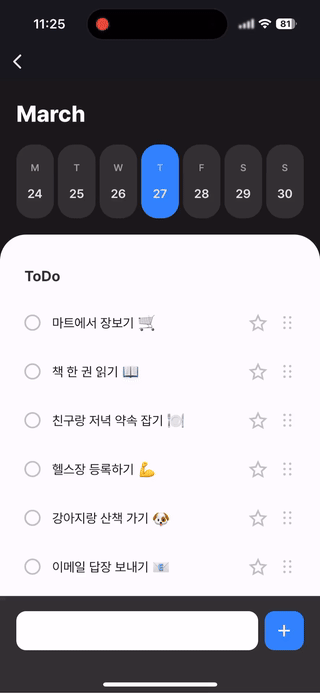

# Weekly Todo Vue


`@apps-in-toss/web-framework`를 활용해 Vue 환경에서 만든 Weekly Todo App이에요.  
이 프레임워크를 사용하면 앱 개발에 대한 깊은 지식이 없어도, 기존 웹 프로젝트를 기반으로 완성도 높고 심리스한 앱을 손쉽게 만들 수 있어요.



<br />

## 🚀 설치 및 실행 방법

1. **ZIP 파일**을 다운로드하고 압축을 풀어주세요.

2. 필요한 패키지를 설치해요.

   ```
   yarn install
   ```

3. 개발 서버를 실행해요.  
   \*iOS 실기기로 테스트 시 [실기기에서 개발 모드 사용하기](https://developers-apps-in-toss.toss.im/tutorials/webview.html#%E1%84%89%E1%85%B5%E1%86%AF%E1%84%80%E1%85%B5%E1%84%80%E1%85%B5%E1%84%8B%E1%85%A6%E1%84%89%E1%85%A5-%E1%84%80%E1%85%A2%E1%84%87%E1%85%A1%E1%86%AF-%E1%84%86%E1%85%A9%E1%84%83%E1%85%B3-%E1%84%89%E1%85%A1%E1%84%8B%E1%85%AD%E1%86%BC%E1%84%92%E1%85%A1%E1%84%80%E1%85%B5)를 참고하여 host 설정을 해주세요.

   ```
   yarn dev
   ```

<br />

## 📌 참고사항

- [WebView 개발하기](https://developers-apps-in-toss.toss.im/tutorials/webview.html)
