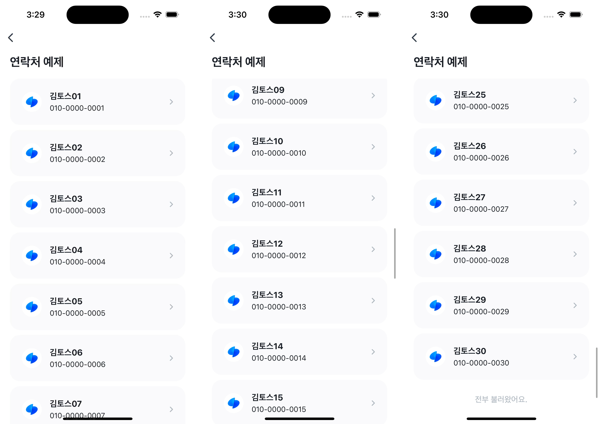

# Contacts Example


`fetchContacts`를 사용하여 사용자의 연락처 목록을 무한 스크롤로 불러오는 예제예요. 스크롤이 끝에 도달하면 자동으로 다음 연락처를 가져와요.



<br />

## 🚀 설치 및 실행 방법

1. **ZIP 파일**을 다운로드하고 압축을 풀어주세요.

2. `.yarnrc.yml` 파일의 `npmAuthToken` 항목에, [toss-design-system 그룹](https://tossmini-docs.toss.im/tds-react-native/setup-npm/)에 초대된 npm 계정의 토큰 값을 입력해주세요.

3. 필요한 패키지를 설치해요.

   ```
   yarn install
   ```

4. 개발 서버를 실행해요.

   ```
   yarn dev
   ```

5. 샘플 연락처가 필요하면 `src/mock` 폴더의 `sample-contacts.vcf`를 다운로드하여 사용할 수 있어요.

<br />

## 📌 참고사항

- [fetchContacts](https://developers-apps-in-toss.toss.im/bedrock/reference/framework/%EC%97%B0%EB%9D%BD%EC%B2%98/fetchContacts.html)
