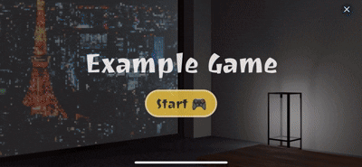

# Example Game

<style type='text/css'>
  [class*="tag-list"] { display: flex; flex-direction: column; gap: 10px; }
  [class*="item"] { display: flex; alineItem: center; gap: 4px; }
  [class*="label"] { margin: 0; padding: 0; padding-top: 2px; }
</style>

<div class="tag-list">
   <div class="item">
      <p class="label">지원 대상:</p>
      
   </div>
   <div class="item">
      <p class="label">실행 환경:</p>
      
      
   </div>
<div>

<br />

`@apps-in-toss/web-framework`를 활용해 React와 Three.js로 만든 게임 예제에요.  
이 예제에서는 사운드, 가로 모드, 게임 프로필, 리더보드 등 게임 개발에 필요한 다양한 요소들을 참고할 수 있어요.

- [**사운드**](https://developers-apps-in-toss.toss.im/checklist/app-game.html#_3-사운드): 배경음, 효과음, 햅틱 등을 적용하는 예시를 볼 수 있어요.
- [**가로 모드**](https://developers-apps-in-toss.toss.im/bedrock/reference/framework/%ED%99%94%EB%A9%B4%20%EC%A0%9C%EC%96%B4/setDeviceOrientation.html#setdeviceorientation): setDeviceOrientation을 사용해 가로 화면으로 전환하는 방법을 확인할 수 있어요.
- [**게임 프로필 & 리더보드**](https://developers-apps-in-toss.toss.im/development/leaderboard.html): 전체 랭킹을 확인하고, 친구를 추가하거나 친구에게 내 점수를 자랑할 수 있어요.



<br />

## 🚀 설치 및 실행 방법

1. **ZIP 파일**을 다운로드하고 압축을 풀어주세요.

2. 필요한 패키지를 설치해요.

   ```
   yarn install
   ```

3. 개발 서버를 실행해요.  
   \*iOS 실기기로 테스트 시 [실기기에서 개발 모드 사용하기](https://developers-apps-in-toss.toss.im/tutorials/webview.html#%E1%84%89%E1%85%B5%E1%86%AF%E1%84%80%E1%85%B5%E1%84%80%E1%85%B5%E1%84%8B%E1%85%A6%E1%84%89%E1%85%A5-%E1%84%80%E1%85%A2%E1%84%87%E1%85%A1%E1%86%AF-%E1%84%86%E1%85%A9%E1%84%83%E1%85%B3-%E1%84%89%E1%85%A1%E1%84%8B%E1%85%AD%E1%86%BC%E1%84%92%E1%85%A1%E1%84%80%E1%85%B5)를 참고하여 host 설정을 해주세요.
   ```
   yarn dev
   ```

<br />

## 📌 참고사항

- [WebView 개발하기](https://developers-apps-in-toss.toss.im/tutorials/webview.html)
- [사운드](https://developers-apps-in-toss.toss.im/checklist/app-game.html#_3-사운드)
- [setDeviceOrientation](https://developers-apps-in-toss.toss.im/bedrock/reference/framework/%ED%99%94%EB%A9%B4%20%EC%A0%9C%EC%96%B4/setDeviceOrientation.html#setdeviceorientation)
- [게임 프로필 & 리더보드](https://developers-apps-in-toss.toss.im/development/leaderboard.html)
