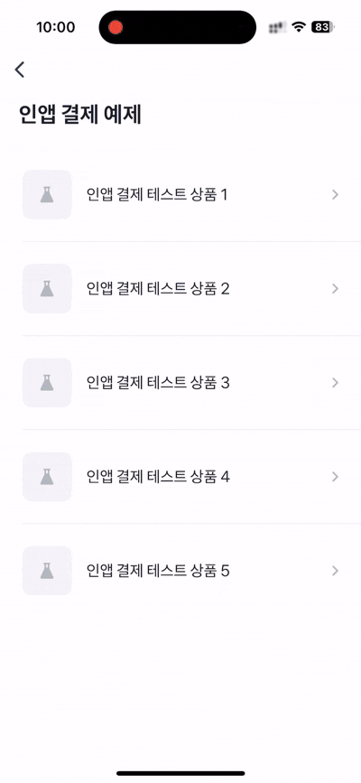

# In App Purchase Example


이 예제는 `getProductItemList`를 사용해 콘솔에 등록한 인앱 결제 상품 목록을 불러오고,  
사용자가 선택한 상품에 대해 `createOneTimePurchaseOrder`를 통해 결제를 진행하는 예제에요.

⚠️ 인앱 결제는 아직 샌드박스 앱에서 테스트할 수 없고, 토스 앱에서 테스트할 경우 실제 결제가 발생해요.  
결제된 금액은 [iOS](https://support.apple.com/ko-kr/118223) 또는 [Android](https://support.google.com/googleplay/answer/2479637?hl=ko)의 환불 정책에 따라 환불을 요청할 수 있어요.



<br />

## 🚀 설치 및 실행 방법

1. **ZIP 파일**을 다운로드하고 압축을 풀어주세요.

2. 필요한 패키지를 설치해요.

   ```
   yarn install
   ```

3. 개발 서버를 실행해요.

   ```
   yarn dev
   ```

<br />

## 📌 참고사항

- [인앱결제 연동하기](https://developers-apps-in-toss.toss.im/iap/develop.html)
