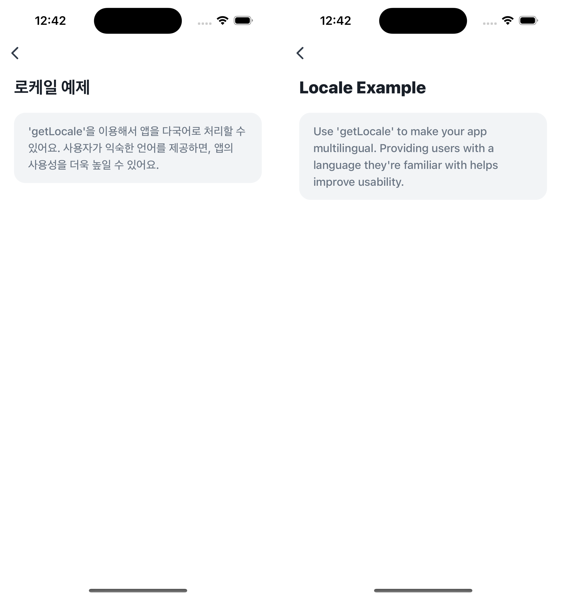

# Locale Example


`getLocale`을 이용해 사용자의 로케일 정보를 가져오고, 이를 기반으로 앱을 다국어로 처리하는 방법을 보여주는 예제에요.  
사용자가 익숙한 언어로 앱을 사용할 수 있도록 제공하면, 전체적인 사용 경험과 접근성이 크게 향상돼요.  
⚠️ 로케일 정보를 가져올 수 없는 경우에는 기본값으로 `'ko-KR'`이 반환되고, 이 예제는 토스 앱 환경에서만 확인할 수 있어요.



<br />

## 📲 체험하기

&nbsp;

<br />

## 🚀 설치 및 실행 방법

1. **ZIP 파일**을 다운로드하고 압축을 풀어주세요.

2. 필요한 패키지를 설치해요.

   ```
   yarn install
   ```

3. 개발 서버를 실행해요.

   ```
   yarn dev
   ```

<br />

## 📌 참고사항

- [getLocale](https://developers-apps-in-toss.toss.im/bedrock/reference/framework/%EC%96%B8%EC%96%B4/getLocale.html)
