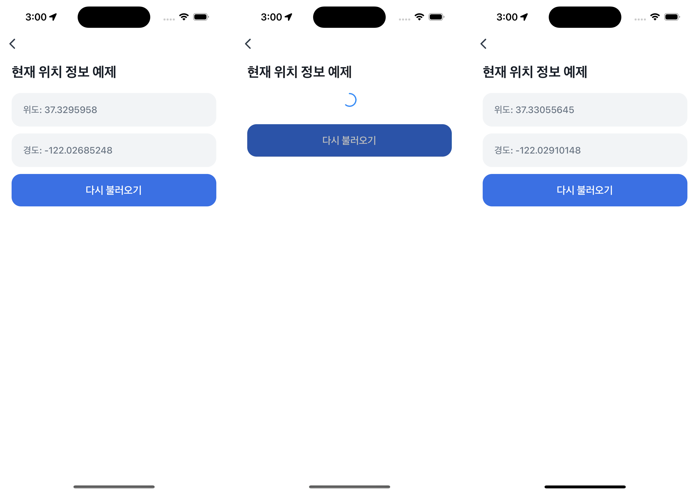

# Location Once Example


`getCurrentLocation`을 사용해 사용자의 현재 위치를 한 번만 가져오고, '다시 불러오기' 버튼을 눌러 위치 정보를 다시 불러올 수 있는 예제예요.



<br />

## 🚀 설치 및 실행 방법

1. **ZIP 파일**을 다운로드하고 압축을 풀어주세요.

2. `.yarnrc.yml` 파일의 `npmAuthToken` 항목에, [toss-design-system 그룹](https://tossmini-docs.toss.im/tds-react-native/setup-npm/)에 초대된 npm 계정의 토큰 값을 입력해주세요.

3. 필요한 패키지를 설치해요.

   ```
   yarn install
   ```

4. 개발 서버를 실행해요.

   ```
   yarn dev
   ```

<br />

## 📌 참고사항

- [getCurrentLocation](https://developers-apps-in-toss.toss.im/bedrock/reference/framework/%EC%9C%84%EC%B9%98%20%EC%A0%95%EB%B3%B4/getCurrentLocation.html)
- [Accuracy](https://developers-apps-in-toss.toss.im/bedrock/reference/framework/%EC%9C%84%EC%B9%98%20%EC%A0%95%EB%B3%B4/Accuracy.html)
- [Location](https://developers-apps-in-toss.toss.im/bedrock/reference/framework/%EC%9C%84%EC%B9%98%20%EC%A0%95%EB%B3%B4/Location.html)
- [LocationCoords](https://developers-apps-in-toss.toss.im/bedrock/reference/framework/%EC%9C%84%EC%B9%98%20%EC%A0%95%EB%B3%B4/LocationCoords.html)
