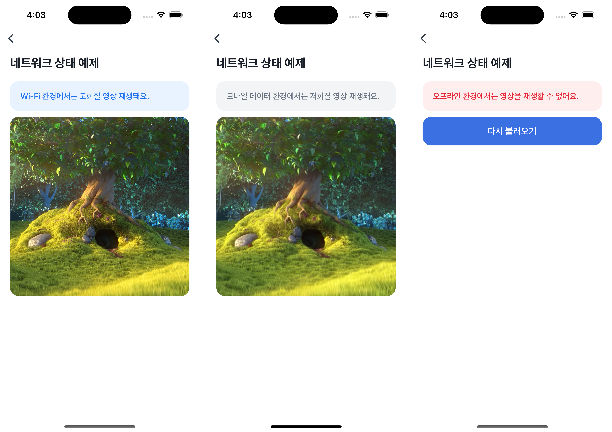

# Network Status Example


`getNetworkStatus`를 사용해 디바이스의 현재 네트워크 상태를 확인하고, 상태에 따라 영상 화질을 다르게 보여주는 예제예요.  
WiFi 환경에서는 고화질 영상이 재생되고, 모바일 데이터 환경에서는 저화질 영상이 재생돼요. 오프라인 상태에서는 영상 시청이 제한돼요.



<br />

## 🚀 설치 및 실행 방법

1. **ZIP 파일**을 다운로드하고 압축을 풀어주세요.

2. `.yarnrc.yml` 파일의 `npmAuthToken` 항목에, [toss-design-system 그룹](https://tossmini-docs.toss.im/tds-react-native/setup-npm/)에 초대된 npm 계정의 토큰 값을 입력해주세요.

3. 필요한 패키지를 설치해요.

   ```
   yarn install
   ```

4. 개발 서버를 실행해요.

   ```
   yarn dev
   ```

<br />

## 📌 참고사항

[Bedrock/react-native/reference/react-native-bedrock/네트워크/getNetworkStatus](https://tossmini-docs.toss.im/react-native/reference/react-native-bedrock/%EB%84%A4%ED%8A%B8%EC%9B%8C%ED%81%AC/getNetworkStatus.html)
