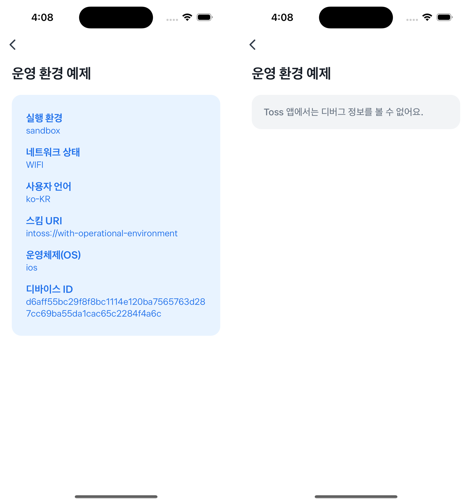

# Operational Environment Example


`getOperationalEnvironment`을 사용해서 앱의 운영 환경에 따라 디버그 정보를 보여주는 예제에요.  
Sandbox 환경에서는 실행 환경, 네트워크 상태, 사용자 언어, 스킴 URI, 운영체제(OS), 디바이스 ID 등의 정보를 확인할 수 있고,  
Toss 앱에서는 디버그 정보를 표시하지 않도록 처리돼 있어요.



<br />

## 🚀 설치 및 실행 방법

1. **ZIP 파일**을 다운로드하고 압축을 풀어주세요.

2. `.yarnrc.yml` 파일의 `npmAuthToken` 항목에, [toss-design-system 그룹](https://tossmini-docs.toss.im/tds-react-native/setup-npm/)에 초대된 npm 계정의 토큰 값을 입력해주세요.

3. 필요한 패키지를 설치해요.

   ```
   yarn install
   ```

4. 개발 서버를 실행해요.

   ```
   yarn dev
   ```

<br />

## 📌 참고사항

[Bedrock/react-native/reference/framework/환경 확인/getOperationalEnvironment](https://tossmini-docs.toss.im/react-native/reference/framework/%ED%99%98%EA%B2%BD%20%ED%99%95%EC%9D%B8/getOperationalEnvironment.html)
