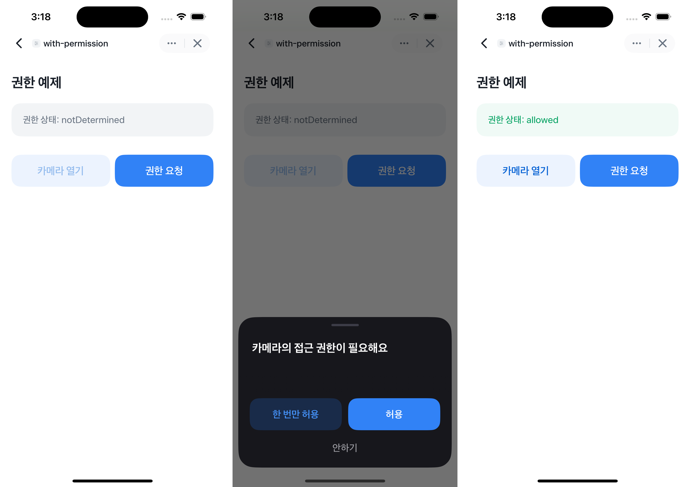

# Permission Example


`getPermission` 을 사용해서 현재 권한을 확인하고, `openPermissionDialog`으로 권한 요청 다이얼로그를 호출하는 예제에요.  
⚠️ 권한이 필요한 모든 기능은 동일한 인터페이스를 제공합니다.



<br />

## 📲 체험하기

&nbsp;

<br />

## 🚀 설치 및 실행 방법

1. **ZIP 파일**을 다운로드하고 압축을 풀어주세요.

2. 필요한 패키지를 설치해요.

   ```
   yarn install
   ```

3. 개발 서버를 실행해요.

   ```
   yarn dev
   ```

<br />

## 📌 참고사항

- [권한 설정하기](https://developers-apps-in-toss.toss.im/bedrock/reference/framework/%EA%B6%8C%ED%95%9C/permission.html)
