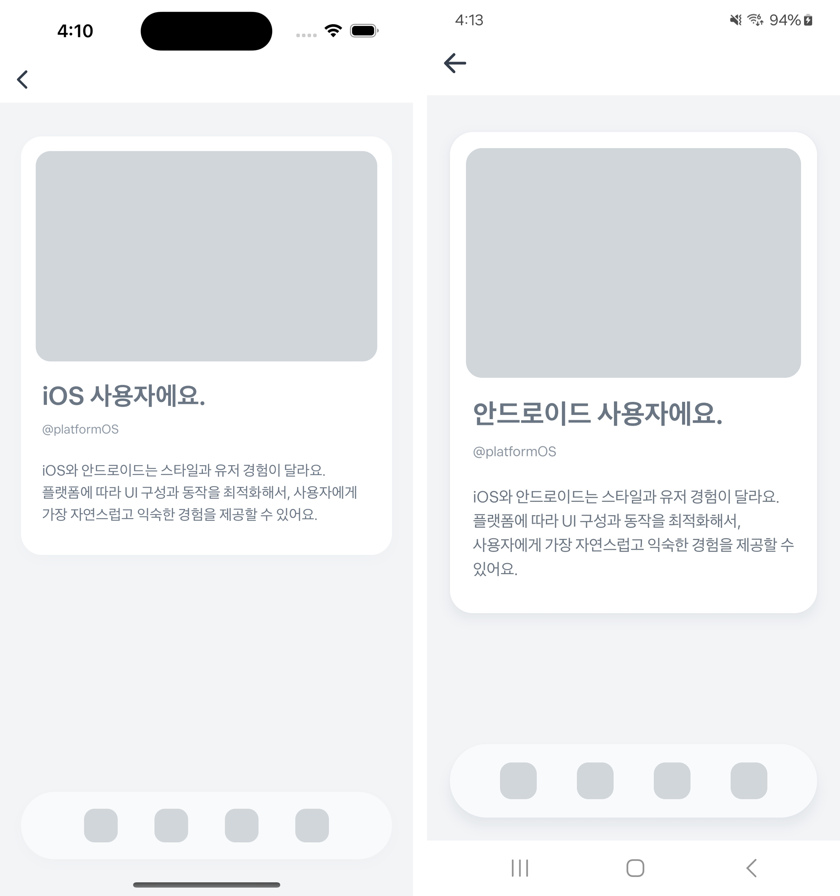

# Platform OS Example


`getPlatformOS`를 사용하여 디바이스의 운영체제에 따라 기능을 분리하고, 스타일을 최적화한 예제예요.  
이렇게 하면 사용자에게 더 익숙하고 자연스러운 경험을 제공할 수 있어서, 좋은 사용자 경험을 만들 수 있어요.



<br />

## 🚀 설치 및 실행 방법

1. **ZIP 파일**을 다운로드하고 압축을 풀어주세요.

2. `.yarnrc.yml` 파일의 `npmAuthToken` 항목에, [toss-design-system 그룹](https://tossmini-docs.toss.im/tds-react-native/setup-npm/)에 초대된 npm 계정의 토큰 값을 입력해주세요.

3. 필요한 패키지를 설치해요.

   ```
   yarn install
   ```

4. 개발 서버를 실행해요.

   ```
   yarn dev
   ```

<br />

## 📌 참고사항

- [getPlatformOS](https://developers-apps-in-toss.toss.im/bedrock/reference/react-native-bedrock/%ED%99%98%EA%B2%BD%20%ED%99%95%EC%9D%B8/getPlatformOS.html)
