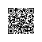

# Rewarded Ad Example


`loadAppsInTossAdMob`를 사용해 광고를 로드하고, `showAppsInTossAdMob`로 광고를 노출하는 예제예요.  
리워드 광고는 사용자가 광고를 시청을 선택하고, 그에 대한 보상을 받을 수 있어 자연스럽고 긍정적인 사용자 경험을 제공할 수 있어요.  
💡 광고 유형은 앱인토스 콘솔에서 광고 그룹 생성 시 리워드 광고 또는 전면 광고를 선택할 수 있어요.


<br />

## 📲 체험하기

&nbsp;

<br />

## 🚀 설치 및 실행 방법

1. **ZIP 파일**을 다운로드하고 압축을 풀어주세요.

2. 필요한 패키지를 설치해요.

   ```
   yarn install
   ```

3. 번들 파일을 생성해요.

   ```
   yarn build
   ```

4. 앱인토스 콘솔에 [앱 번들 업로드](https://developers-apps-in-toss.toss.im/development/test/toss.html#_1-%E1%84%8B%E1%85%A2%E1%86%B8-%E1%84%87%E1%85%A5%E1%86%AB%E1%84%83%E1%85%B3%E1%86%AF-%E1%84%8B%E1%85%A5%E1%86%B8%E1%84%85%E1%85%A9%E1%84%83%E1%85%B3)를 하고 테스트해요.

<br />

## 📌 참고사항

- [loadAppsInTossAdMob](https://developers-apps-in-toss.toss.im/bedrock/reference/framework/%EA%B4%91%EA%B3%A0/loadAppsInTossAdMob.html)
- [showAppsInTossAdMob](https://developers-apps-in-toss.toss.im/bedrock/reference/framework/%EA%B4%91%EA%B3%A0/showAppsInTossAdMob.html)
