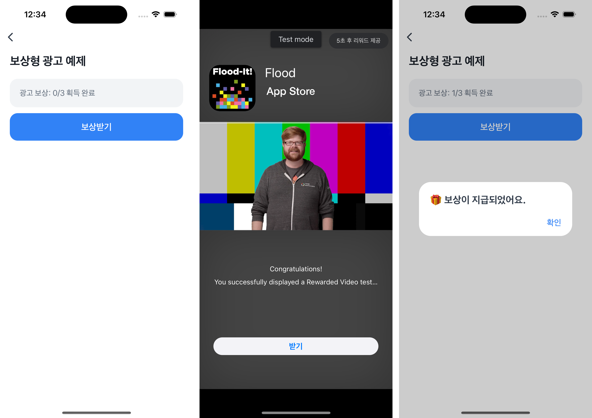

# Rewarded Ad Example


`loadAdMobRewardedAd`를 사용해 보상형 광고를 로드하고, `showAdMobRewardedAd`로 광고를 노출하는 예제예요.  
보상형 광고는 사용자가 광고 시청을 선택하고, 그에 대한 보상을 받을 수 있어 자연스럽고 긍정적인 사용자 경험을 제공할 수 있어요.  
⚠️ 이 예제는 토스 앱 환경에서만 확인할 수 있어요.



<br />

## 🚀 설치 및 실행 방법

1. **ZIP 파일**을 다운로드하고 압축을 풀어주세요.

2. `.yarnrc.yml` 파일의 `npmAuthToken` 항목에, [toss-design-system 그룹](https://tossmini-docs.toss.im/tds-react-native/setup-npm/)에 초대된 npm 계정의 토큰 값을 입력해주세요.

3. 필요한 패키지를 설치해요.

   ```
   yarn install
   ```

4. `src/hooks/useRewardedAd.ts`에 **Ad Unit ID**를 입력해요.

   ```ts
   const AD_UNIT_ID = '<YOUR_AD_UNIT_ID>';
   ```

5. 번들 파일을 생성해요.

   ```
   yarn build
   ```

6. 앱인토스 콘솔에 [앱 번들 업로드](https://developers-apps-in-toss.toss.im/release/overview.html#_1-%E1%84%8B%E1%85%A2%E1%86%B8-%E1%84%87%E1%85%A5%E1%86%AB%E1%84%83%E1%85%B3%E1%86%AF-%E1%84%8B%E1%85%A5%E1%86%B8%E1%84%85%E1%85%A9%E1%84%83%E1%85%B3)를 하고 테스트해요.

<br />

## 📌 참고사항

- [loadAdMobRewardedAd](https://developers-apps-in-toss.toss.im/bedrock/reference/framework/%EA%B4%91%EA%B3%A0/loadAdMobRewardedAd.html)
- [showAdMobRewardedAd](https://developers-apps-in-toss.toss.im/bedrock/reference/framework/%EA%B4%91%EA%B3%A0/showAdMobRewardedAd.html)
