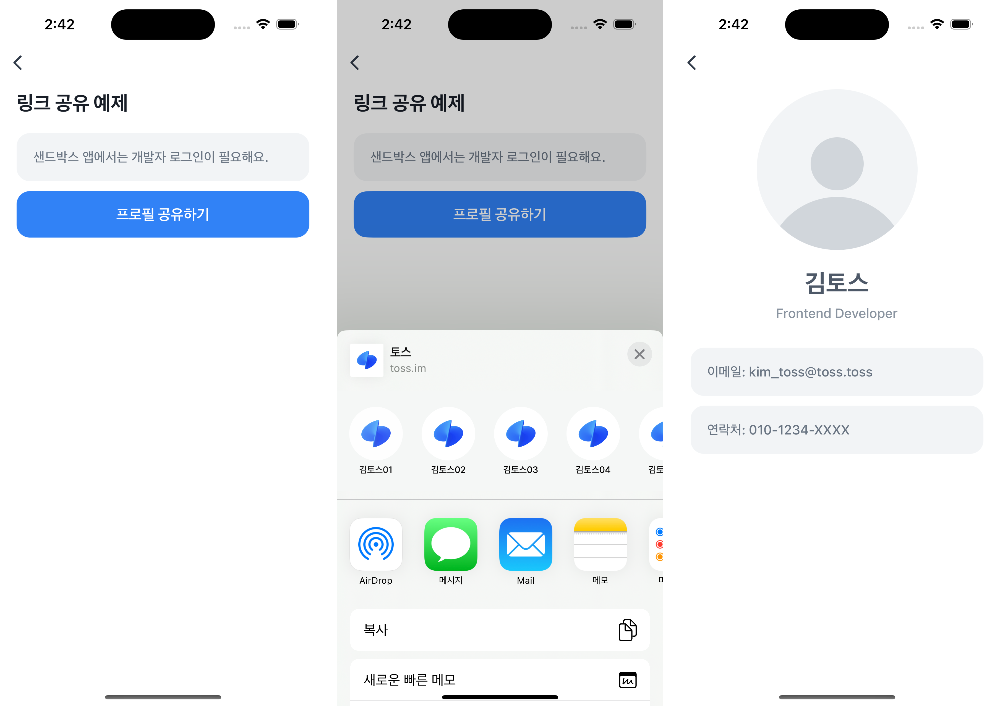

# Share Link Example


`getTossShareLink`를 사용해 프로필 페이지의 딥링크를 생성하고, `Share`로 공유하는 예제예요.  
 ⚠️ 이 예제를 실행하려면 토스 앱이 설치되어 있어야 해요.



<br />

## 🚀 설치 및 실행 방법

1. **ZIP 파일**을 다운로드하고 압축을 풀어주세요.

2. `.yarnrc.yml` 파일의 `npmAuthToken` 항목에, [toss-design-system 그룹](https://tossmini-docs.toss.im/tds-react-native/setup-npm/)에 초대된 npm 계정의 토큰 값을 입력해주세요.

3. 필요한 패키지를 설치해요.

   ```
   yarn install
   ```

4. 개발 서버를 실행해요.

   ```
   yarn dev
   ```

<br />

## 📌 참고사항

[Bedrock/react-native/reference/framework/공유/getTossShareLink](https://tossmini-docs.toss.im/react-native/reference/framework/%EA%B3%B5%EC%9C%A0/getTossShareLink.html)
