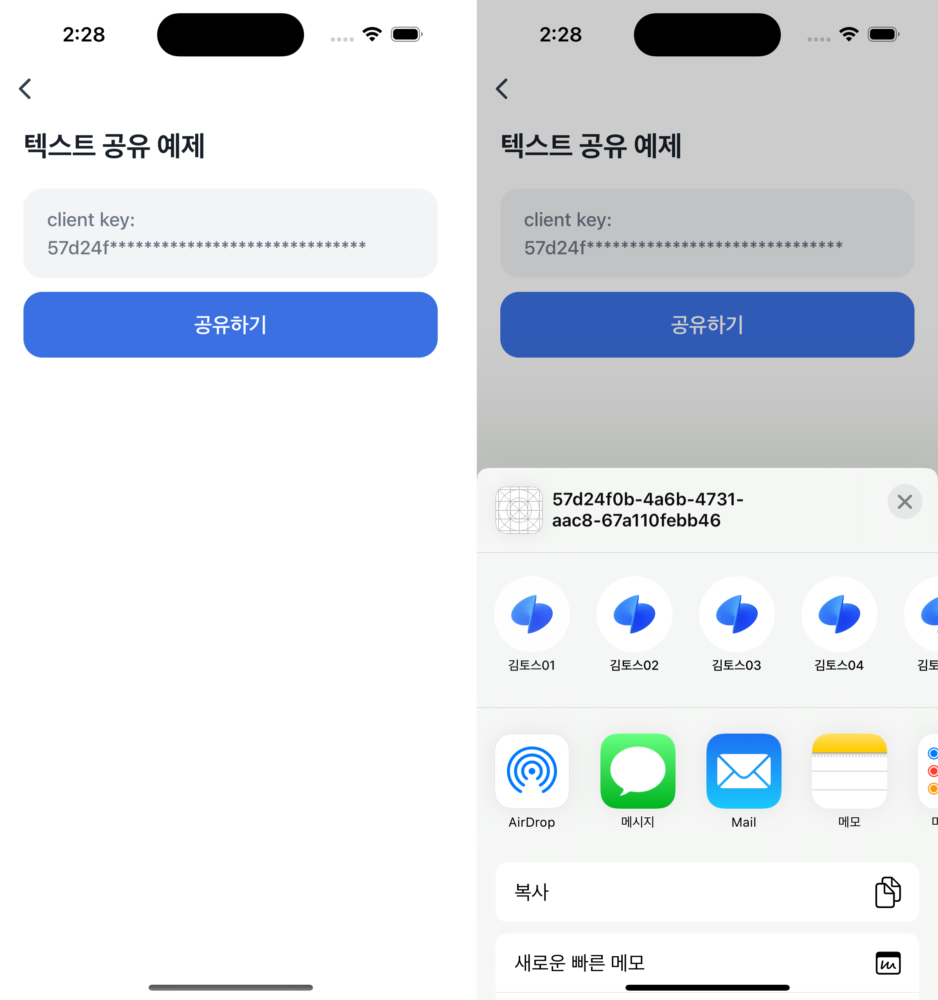

# Share Text Example


`share`를 사용해서 클라이언트 키를 텍스트로 공유하는 예제예요.  
화면에는 마스킹된 키를 보여주고, 버튼을 누르면 실제 원본 키가 공유돼요.



<br />

## 🚀 설치 및 실행 방법

1. **ZIP 파일**을 다운로드하고 압축을 풀어주세요.

2. `.yarnrc.yml` 파일의 `npmAuthToken` 항목에, [toss-design-system 그룹](https://tossmini-docs.toss.im/tds-react-native/setup-npm/)에 초대된 npm 계정의 토큰 값을 입력해주세요.

3. 필요한 패키지를 설치해요.

   ```
   yarn install
   ```

4. 개발 서버를 실행해요.

   ```
   yarn dev
   ```

<br />

## 📌 참고사항

- [share](https://developers-apps-in-toss.toss.im/bedrock/reference/react-native-bedrock/%EA%B3%B5%EC%9C%A0/share.html)
